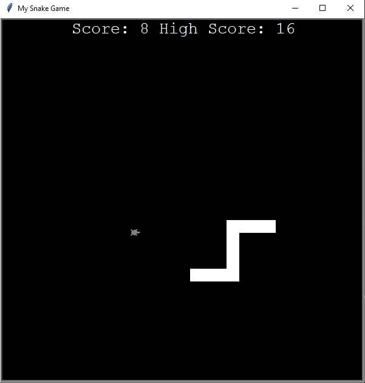

# Snake Game

Welcome to the Snake Game! This is a classic arcade-style game where you control a snake to eat food and grow in length. Avoid running into walls or your own tail!

## How to Play
1. Use the arrow keys (Up, Down, Left, Right) to control the snake's direction.
2. The snake will move continuously in the direction it is facing.
3. Eat the food (green dot) to grow longer.
4. Avoid running into walls or the snake's own tail, as this will end the game.

## Features
- Simple and intuitive gameplay.
- Colorful graphics using the Turtle module.
- Increasing difficulty as the snake grows longer.
- Scoreboard to track your score.
- Ability to save and load high scores to/from a file.

## Files
- `snake_game.py`: Main game script that initializes the game and handles game logic.
- `snake.py`: Snake class that defines the behavior of the snake.
- `food.py`: Food class that defines the behavior of the food.
- `scoreboard.py`: Scoreboard class that tracks and displays the player's score.
- `data.txt`: File to save and load high scores.

## Usage
1. Run the `snake_game.py` file using a Python interpreter.
2. Use the arrow keys to control the snake and eat the food.
3. Try to achieve the highest score possible!

## Screenshots

## Credits
- Developed by [Supun Wickramarachchi](https://github.com/supunwickramarachchi).
- Inspired by the classic Snake game.

Feel free to customize this game, add more features, or improve the interface. Have fun playing Snake!
